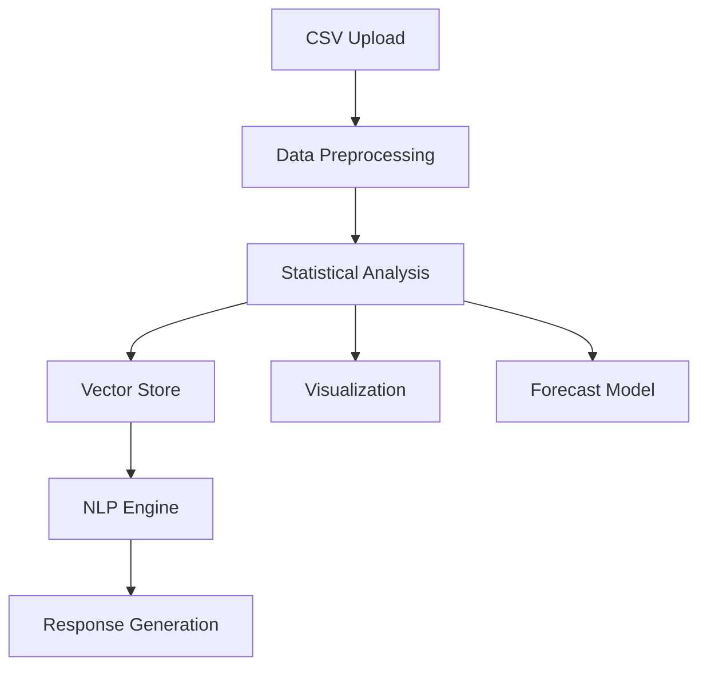

# AI-Powered Business Intelligence Assistant

An intelligent analytics solution that combines natural language processing with business intelligence to provide data insights through conversational AI.

## Key Features

- **CSV Data Analysis**: Upload and analyze business data in CSV format
- **Auto-Column Detection**: Automatic detection of date, product, and sales columns
- **Statistical Summaries**: Automatic generation of key business metrics
- **Interactive Visualizations**: 
  - Sales trend charts
  - Product performance bar graphs
  - Forecasted sales predictions
- **Natural Language Query**: Ask business questions in plain English
- **Sales Forecasting**: Linear regression predictions with visualization
- **Export Capabilities**: Download forecasts and insights as CSV
---
## Installation

1. Clone repository:
```bash
git clone https://github.com/VasanSoundararajan/StreamlitBuisnessAI.git
cd StreamlitBuisnessAI
```

2. Install requirements:
```bash
pip install -r requirements.txt
```

3. Start the application:
```bash
streamlit run BuisnessAI.py
```
---
## Usage

1. **Upload Data**  
   Upload a CSV file through the sidebar. Supported columns:
   - Date (any format)
   - Product names
   - Sales numbers
   - Region information
   - Customer demographics

2. **Initialize System**  
   Click "Initialize System" to prepare the AI analysis engine

3. **Ask Questions**  
   In the "Ask Question" tab:
   - Type natural language questions about your data
   - Try example prompts:
     * "What are our top performing products?"
     * "Show sales trends from last quarter"
     * "Which region has highest growth potential?"

4. **Generate Visuals**  
   In the "Visualize & Forecast" tab:
   - Select chart types from dropdown
   - Adjust forecast period with slider
   - Download generated forecasts as CSV
---
## Technical Overview

### Stack
- **Frontend**: Streamlit
- **NLP Engine**: LangChain + Hugging Face Transformers
- **Embeddings**: sentence-transformers/all-MiniLM-L6-v2
- **Vector DB**: FAISS
- **Forecasting**: scikit-learn LinearRegression
- **Base Model**: DistilGPT-2 (default, can be customized)
---
### Architecture

---
## Limitations & Considerations

- Initial version uses DistilGPT2 for fast inference - consider larger models (GPT-3.5/4, Llama2) for complex analyses
- Requires minimum 4GB RAM (8GB recommended)
- Input data must contain at least date and sales columns
- Forecasting uses simple linear regression - consider ARIMA or Prophet for production use
---
## License

MIT License - See [LICENSE](LICENSE) for details
---
## Contributing

Contributions welcome! Please follow these steps:
1. Fork the repository
2. Create your feature branch (`git checkout -b VasanSoundararajan/StreamlitBuisnessAI`)
3. Commit your changes (`git commit -m 'Add some amazing feature'`)
4. Push to the branch (`git push origin VasanSoundararajan/StreamlitBuisnessAI`)
5. Open a Pull Request

---
